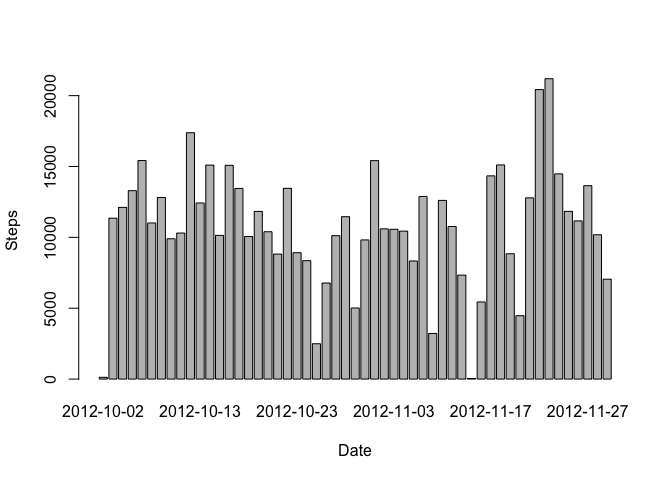
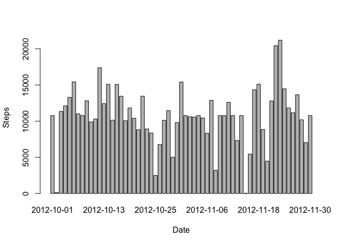
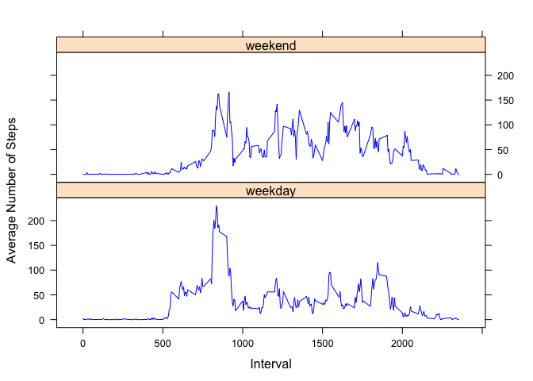

# Reproducible Research: Peer Assessment 1


## Loading and preprocessing the data

Load the data and have a look at its structure


```r
data <- read.csv("activity.csv")
str(data)
```

```
## 'data.frame':	17568 obs. of  3 variables:
##  $ steps   : int  NA NA NA NA NA NA NA NA NA NA ...
##  $ date    : Factor w/ 61 levels "2012-10-01","2012-10-02",..: 1 1 1 1 1 1 1 1 1 1 ...
##  $ interval: int  0 5 10 15 20 25 30 35 40 45 ...
```

Preprocessing using Lubridate package for dates


```r
library(lubridate)
data$date <- ymd(data$date)
class(data$date)
```

```
## [1] "POSIXct" "POSIXt"
```


## What is mean total number of steps taken per day?

Computing total steps taken each day


```r
StepsPerDay <- aggregate(steps ~ date, data = data, sum, na.rm = TRUE)
head(StepsPerDay)
```

```
##         date steps
## 1 2012-10-02   126
## 2 2012-10-03 11352
## 3 2012-10-04 12116
## 4 2012-10-05 13294
## 5 2012-10-06 15420
## 6 2012-10-07 11015
```

Histogram of total steps (Y axis) vs Date (X-axis)


```r
barplot(StepsPerDay$steps, names.arg = StepsPerDay$date, xlab = 'Date', ylab = 'Steps')
```

 

MEAN number of steps taken per day


```r
mean(StepsPerDay$steps)
```

```
## [1] 10766.19
```

MEDIAN of number of steps taken per day


```r
median(StepsPerDay$steps)
```

```
## [1] 10765
```


## What is the average daily activity pattern?

Averaging steps for each 5 minute interval across all days


```r
AverageStepsPerInterval <- aggregate(steps ~ interval, data = data, mean, na.rm = TRUE)
head(AverageStepsPerInterval)
```

```
##   interval     steps
## 1        0 1.7169811
## 2        5 0.3396226
## 3       10 0.1320755
## 4       15 0.1509434
## 5       20 0.0754717
## 6       25 2.0943396
```

Time series plot of 5-min interval (x axis) and average number of steps taken (y axis)


```r
plot(AverageStepsPerInterval$interval, AverageStepsPerInterval$steps, type = 'l',
     xlab = "Interval", ylab = "Average Steps")
```

 

Identifying the interval in which maximum number of steps are taken on average


```r
index <- which(AverageStepsPerInterval$steps == max(AverageStepsPerInterval$steps))
AverageStepsPerInterval$interval[index] # The Interval with maximum steps
```

```
## [1] 835
```

```r
AverageStepsPerInterval$steps[index] # Maximum number of steps (average) which is the value of above interval
```

```
## [1] 206.1698
```

## Imputing missing values

Computing total number of missing values


```r
sum(is.na(data$steps))
```

```
## [1] 2304
```

Filling missing values using the average number of steps taken in an interval - averaged across all days (i.e using the AverageStepsPerInterval computed above).


```r
newdata <- data
for(i in 1:length(newdata$interval)){
        if(is.na(newdata$steps[i])){
                index <- which(AverageStepsPerInterval$interval == newdata$interval[i])
                newdata[i,1] <- AverageStepsPerInterval$steps[index]
        }
}
```

Checking how many missing values are there in newdata


```r
sum(is.na(newdata$steps))
```

```
## [1] 0
```
Hence all missing values have been filled.

Making histogram using newdata

```r
NewStepsPerDay <- aggregate(steps ~ date, data = newdata, sum, na.rm = TRUE)
barplot(NewStepsPerDay$steps, names.arg = NewStepsPerDay$date, xlab = 'Date', ylab = 'Steps')
```

 

MEAN number of steps taken per day


```r
mean(NewStepsPerDay$steps)
```

```
## [1] 10766.19
```

MEDIAN of number of steps taken per day


```r
median(NewStepsPerDay$steps)
```

```
## [1] 10766.19
```

Mean is the same and Median differs slightly.

## Are there differences in activity patterns between weekdays and weekends?

Creating new factor variable (daytype) for identifying Weekday or Weekend


```r
newdata$daytype <- "weekday"
newdata$daytype[weekdays(newdata$date) %in% c('Saturday', 'Sunday')] <- "weekend"
newdata$daytype <- as.factor(newdata$daytype)
str(newdata)
```

```
## 'data.frame':	17568 obs. of  4 variables:
##  $ steps   : num  1.717 0.3396 0.1321 0.1509 0.0755 ...
##  $ date    : POSIXct, format: "2012-10-01" "2012-10-01" ...
##  $ interval: int  0 5 10 15 20 25 30 35 40 45 ...
##  $ daytype : Factor w/ 2 levels "weekday","weekend": 1 1 1 1 1 1 1 1 1 1 ...
```

Averaging number of steps for each interval for each day type (i.e Grouping by interval and daytype and taking the mean) and then plotting the panel plot.


```r
# Grouping by interval and daytype
AverageStepsPerIntervalPerDaytype <- aggregate(steps ~ interval + daytype, data = newdata, mean, na.rm = TRUE) 

# Creating panel plot using lattice package
library(lattice)
xyplot(steps ~ interval | daytype, AverageStepsPerIntervalPerDaytype, layout = c(1, 2), type = "l", col="blue", xlab="Interval", ylab = "Average Number of Steps")
```

 
